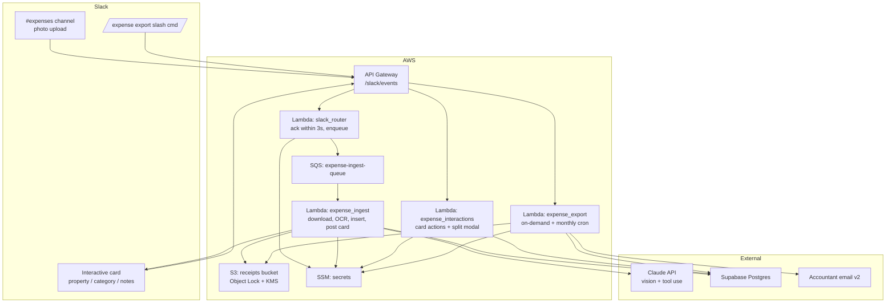

# Expense & Receipt Capture — Design Doc

**Status:** Proposal
**Owner:** VJ
**Target:** MVP live within two weekends of coding
**Sibling to:** the guest-alerts flow in `src/handler.py`; the upcoming task-management workflow

## Summary

Team members (VJ, Maggie, Christin, Asher) snap a receipt, drop it in Slack, tag the property. The bot OCRs, categorizes against IRS Schedule E line items, files it to Postgres, and stores the image in S3. End of year: one command produces a CSV+PDF bundle per property for the accountant. No more shoebox.

---

## 1. Capture UX in Slack

**Primary entry point:** a dedicated `#expenses` channel. Any image posted there is treated as a receipt. No slash command, no form — lowest possible friction so people actually use it.

**Secondary entry point:** DM the bot with an image. Same pipeline. (Post-MVP — see §9.)

### Happy path

```
Christin uploads IMG_4421.jpg to #expenses
  caption: "Home Depot — Palm Club, new garbage disposal"

Bot adds 👀 reaction within 2s (ack before OCR)
Bot runs Claude vision OCR in background (~3–6s)

Bot replies in thread with a Block Kit card:

  ┌──────────────────────────────────────────────┐
  │ 🧾 Receipt extracted                          │
  │                                               │
  │ Merchant:    Home Depot #0438                │
  │ Date:        2026-04-18                      │
  │ Subtotal:    $287.42                         │
  │ Tax:         $ 24.55                         │
  │ Total:       $311.97                         │
  │                                               │
  │ Property:    [ The Palm Club      ▾ ]        │
  │ Category:    [ Repairs            ▾ ]        │
  │ Payer:       [ Christin (Amex)    ▾ ]        │
  │ Notes:       [ new garbage disposal      ]   │
  │                                               │
  │ [ ✅ File it ]  [ ✂️  Split ]  [ 🗑 Skip ]     │
  └──────────────────────────────────────────────┘

Christin clicks File it.
Bot: ✅ Filed EXP-2026-0417 · The Palm Club · Repairs · $311.97
Bot adds ✅ reaction to the original photo.
```

The card is the single point of confirmation. No wizards, no follow-up questions the happy path doesn't need.

### Edge cases

**No caption.** OCR still runs. The card posts with property unset; bot pings the submitter in-thread: "Which property? *The Palm Club* · *Villa Bougainvillea* · *Split*" as buttons inline. Other fields pre-filled from OCR.

**Ambiguous or low-confidence OCR.** Any field where Claude returned `category_confidence` or `extraction_confidence` of `low` is visually flagged (red dot next to the label) and rendered as an editable input instead of a static value. Submitter edits before clicking File it.

**Multi-property Costco run.** Submitter clicks **Split**. Modal opens:

```
  Split $311.97 across properties
  ──────────────────────────────────────
  The Palm Club       [ 60 ] %   $187.18
  Villa Bougainvillea [ 40 ] %   $124.79
  ──────────────────────────────────────
  [ Save split ]   (must sum to $311.97)
```

Percent and dollar fields stay in sync; Save is disabled until sum matches total. One `expense_allocations` row per property (§3). Single-property receipts = one allocation row at 100%.

**Personal / mixed-use.** Skip button flags the record with `is_personal = true` and does *not* include it in exports. Useful for Costco runs where part was personal groceries.

**Duplicate submission.** Dedupe on (perceptual image hash) OR (merchant + date + total) within a 48h window. Bot warns in thread: "This looks like a duplicate of EXP-2026-0416. File anyway? [Yes / No]". (v2 — §9.)

---

## 2. OCR / extraction strategy

| Dimension | Claude vision (tool use) | AWS Textract `AnalyzeExpense` | Veryfi / Mindee |
|---|---|---|---|
| Accuracy on crumpled/faded/angled photos | ★★★★ multimodal reasoning | ★★★ solid on layout, weaker on handwriting | ★★★★★ receipt-specific priors |
| Structured output | Native via tool-use schema | Native fields but looser | Native, strong line items |
| Category inference in one call | Yes | No — needs a second step | Partial (merchant → category) |
| Cost at ~400/yr | ~$2 (Haiku) or ~$8 (Sonnet) | ~$0.60 | ~$40–100 |
| New vendor / auth / IAM | No — already in stack | No | Yes |
| Implementation complexity | 1 API call, 1 tool schema | Textract job + parser + categorizer | SDK integration |

**Pick: Claude Sonnet 4.6 vision with a strict tool-use schema.**

Why:
- Already in the stack (`classifier.py` uses Sonnet for drafting). Zero new vendors, secrets, or IAM boundaries.
- Tool use makes the output contract explicit and machine-checkable.
- Multimodal reasoning wins on the long-tail messy cases (handwritten tips, thermal fade, angled photos).
- At 400/yr, cost is a rounding error — do not optimize for it.
- One call handles OCR + category suggestion + confidence flags.

Fallback plan: if a specific merchant format gives us trouble, add Textract `AnalyzeExpense` as a second pass and merge results. `expenses.ocr_payload` is JSONB (§3) so we can stash both.

### Tool schema (abbreviated)

```json
{
  "name": "extract_receipt",
  "input_schema": {
    "merchant_name": "string",
    "merchant_address": "string?",
    "transaction_date": "YYYY-MM-DD",
    "subtotal": "number",
    "tax": "number",
    "tip": "number?",
    "total": "number",
    "currency": "string (default USD)",
    "payment_method": "string? e.g. 'Visa ****1234'",
    "line_items": [{"description": "string", "qty": "number", "amount": "number"}],
    "suggested_category": "enum of Schedule E categories (§6)",
    "category_confidence": "high | medium | low",
    "extraction_confidence": "high | medium | low",
    "needs_review_reason": "string?"
  }
}
```

Confidence fields drive the "red dot" UI in §1.

---

## 3. Data model

**Pivot from the original draft (2026-04-20):** the sibling `/task` workflow shipped with S3+JSON storage, not Postgres, which moots the original "shared `properties` and `users` tables" argument for Postgres. Since tasks can live happily without SQL, expenses will too — at least for MVP. Aggregation (§7) is deferred; if it becomes necessary later, the JSON objects are easy to reload into Postgres or DuckDB for query.

**Storage:** one JSON object per expense in S3 at `expenses/<year>/<id>.json`. Mirrors `task_store.py` conventions. S3 versioning is the free audit trail.

```python
# src/expense_models.py
@dataclass
class Expense:
    id: str                       # "EXP-2026-0042"
    submitter_slack_id: str       # raw Slack user id; no user table
    merchant_name: str
    transaction_date: str         # "YYYY-MM-DD" — the date PRINTED on the receipt
    total: str                    # decimal as string, e.g. "311.97"
    currency: str
    image_s3_key: str
    image_sha256: str             # for future dedupe (v2)
    ocr_payload: dict             # raw extract_receipt tool output
    ocr_model: str
    slack_channel_id: str
    slack_thread_ts: str
    created_at: str               # ISO-8601 UTC with trailing Z
    updated_at: str
    # Optional, filled in as user confirms the card:
    subtotal: Optional[str] = None
    tax: Optional[str] = None
    tip: Optional[str] = None
    category_id: Optional[str] = None           # "repairs", "supplies", ...
    property_id: Optional[str] = None           # Hospitable UUID — same id space as seed/properties.json
    payment_method: Optional[str] = None        # freeform
    notes: Optional[str] = None
    thumbnail_s3_key: Optional[str] = None
    ocr_extraction_confidence: Optional[str] = None  # high | medium | low
    ocr_category_confidence: Optional[str] = None
    needs_review: bool = False
    review_reason: Optional[str] = None
    is_personal: bool = False
    allocations: list[Allocation] = []           # v2 splits; MVP always [Allocation.single(...)]

@dataclass
class Allocation:
    property_id: str              # Hospitable UUID
    percent: str                  # decimal string, "100.00" for single-property MVP
    amount: str                   # decimal string
```

### S3 layout

```
s3://hospitality-hq-expenses/
  expenses/<year>/<id>.json             full metadata
  receipts/<year>/<id>.<ext>            original image — Object Lock per-object
  thumbs/<year>/<id>.jpg                1024px preview for Slack
  exports/<year>/<export_id>.zip        year-end bundle (v2)
  indexes/slack/<thread_ts>.json        {"expense_id": "EXP-..."}
```

### What we lose vs. Postgres

- **Aggregation.** "SUM(total) by category by property" is a LIST + parallel GET over the year's expenses, not a SQL query. At <500 expenses/year this is <500ms and acceptable; at 10× that we'd reload into DuckDB or move to Postgres. Year-end export (§7) is where this matters.
- **Referential integrity.** A category_id typo won't trip a foreign-key check. We guard it with a unit test (`test_expense_categories.test_category_ids_in_merchant_patterns_all_exist`) and application-level validation on write.
- **No allocations/event tables.** Allocations are a list field on the expense. The "audit log" collapses to S3 object versioning — coarser-grained but free and sufficient.

### What we gain

- **Zero new infra.** S3 bucket only. No Postgres instance, no connection pooling in Lambda, no SSM secret, no VPC plumbing. Same ops story as `/task`.
- **Debuggability.** `aws s3 cp s3://... - | jq` reads any expense. No psql.
- **Human-readable `id`** (`EXP-YYYY-####`) derived via a LIST + increment on write. Tiny race window accepted at our volume.
- **Static seed bundling.** Categories and merchant patterns live in `seed/expense_*.json`, bundled with the Lambda. No config-in-S3 round-trip.

### Properties and submitters

- **Property IDs** are the same Hospitable UUIDs used by the `/task` workflow (see `seed/properties.json`). The expense workflow reads that seed to populate the Slack property dropdown.
- **Submitters** are identified by raw Slack user ID. No user table, no separate seed. Display names resolved via Slack API if ever rendered.

---

## 4. Image storage

**Pick: S3, SSE-KMS, Object Lock (governance mode, 7-year retention), lifecycle transition to Glacier Deep Archive at 1 year.**

Rationale:
- Durability: 11 9s. Receipts are legally required artifacts — we cannot lose them.
- IRS retention: the safe-harbor floor is 7 years for records supporting a deduction. Object Lock enforces it so we cannot accidentally `aws s3 rm` the evidence.
- Cost: 400 × 2 MB = 800 MB/yr. Standard ≈ $0.02/mo, Deep Archive ≈ $0.001/mo. Negligible.
- Already in the AWS boundary — no new IAM, no new vendor.
- Signed URLs give Slack thumbnails without a public bucket.

**Rejected:**
- **Google Drive:** OAuth token rot, no native signed URLs, export is manual, no Object Lock equivalent. Acceptable personal tool, unacceptable tax-record system.
- **Cloudflare R2:** fine technically, but no reason to leave AWS given the current stack.
- **Blob in the database:** bloats backups, destroys PITR ergonomics. Don't.

**Key layout:**
```
s3://hospitality-hq-receipts/
  originals/{yyyy}/{expense_id}.{ext}    Object Lock on, KMS-encrypted, immutable
  thumbs/{yyyy}/{expense_id}.jpg         1024px, for Slack previews
  exports/{yyyy}/{export_id}.zip         90-day lifecycle expiry
```

Thumbnails generated by Pillow on ingest. Cheaper to serve than re-signing originals on every Slack render.

---

## 5. Data store recommendation — superseded

**Final pick: S3 + JSON** (see §3 for the pivot note). The original comparison below is preserved for historical record.

| Criterion | DynamoDB | Notion | Postgres (Supabase) |
|---|---|---|---|
| "All repairs on Palm Club in 2026" | GSI + denormalize per query | Filter views, no joins, no SUMs | Trivial SQL |
| Human-readable fallback (Maggie opens and skims) | None | Excellent | Supabase Table Editor ≈ spreadsheet |
| CSV for accountant | Write code | Native button | `\copy (select ...) to 'out.csv' csv header` |
| Fits sibling task workflow | Yes but denormalized | Scares me as system of record | Shares `properties`/`users` cleanly |
| Ops burden | Already using; low | Rate limits, brittle | Supabase free tier = near-zero |
| ACID / constraints / audit | Weak txn story | None | Real |

**Pick: Postgres on Supabase.**

- Accountant queries are just SQL. Biggest single win.
- Supabase Table Editor gives Maggie a browsable UI for free — criterion met without building anything.
- Shares `properties` + `users` with the upcoming task workflow.
- Free tier handles our volume by four orders of magnitude; backups + PITR included.
- Connection string lives in SSM alongside existing secrets — consistent with `src/config.py`.

**Why not DynamoDB.** We use it today for state-tracker dedup because the access pattern is keyed and tiny. Expenses want aggregations, joins, and human browsing — Dynamo is the wrong shape. Keep Dynamo for `state_tracker.py`; add Postgres for this domain.

**Why not Notion.** Great UX, weak contract. These are tax records; we need real constraints and real transactions, not a document store that can be reshaped by accident. Fine as a read-only dashboard in v3.

---

## 6. Categorization

### Taxonomy — 1:1 with Schedule E

| `id` | Display | Schedule E line |
|---|---|---|
| `advertising` | Advertising | Advertising |
| `auto_travel` | Auto & Travel | Auto and travel |
| `cleaning_maintenance` | Cleaning & Maintenance | Cleaning and maintenance |
| `commissions` | Commissions (OTA) | Commissions |
| `insurance` | Insurance | Insurance |
| `legal_professional` | Legal & Professional Fees | Legal and other professional fees |
| `management_fees` | Management Fees | Management fees |
| `mortgage_interest` | Mortgage Interest | Mortgage interest paid to banks |
| `other_interest` | Other Interest | Other interest |
| `repairs` | Repairs | Repairs |
| `supplies` | Supplies | Supplies |
| `taxes` | Taxes (property, occupancy) | Taxes |
| `utilities` | Utilities | Utilities |
| `depreciation` | Depreciation | Depreciation *(tracked separately; not via receipts)* |
| `other` | Other | Other (specify) |
| `personal_skip` | Personal — do not deduct | N/A |

Deliberate rule: we do **not** invent our own subcategories (no "hot tub chemicals", no "thermostat batteries"). Anything domain-specific goes in the `notes` column on the expense. The export reads cleanly onto Schedule E with no remapping.

### Assignment — hybrid, in this order

1. **Merchant rules table (`merchant_patterns`).** Deterministic ILIKE match on merchant name. Wins over the LLM when it fires. Auditable, cheap, fast.
2. **LLM suggestion.** Claude produces `suggested_category` + `category_confidence` inside the same `extract_receipt` tool call when no rule matched.
3. **User confirmation.** Always. Dropdown pre-filled; one click confirms or overrides.
4. **Learning.** Every override inserts a row into `merchant_patterns` scoped to that merchant + submitter. After 2–3 months the rules table handles most traffic.

If both rule and LLM are low-confidence: `needs_review = true`, yellow stripe on the card.

### Seed rules (day-one hand-seed)

```sql
insert into merchant_patterns (pattern, category_id, note) values
  ('Home Depot%',         'supplies',        'Default; flip to repairs for contractor charges'),
  ('Lowes%',              'supplies',        null),
  ('Costco%',             'supplies',        null),
  ('Amazon%',             'supplies',        null),
  ('Target%',             'supplies',        null),
  ('Walmart%',            'supplies',        null),
  ('Roto-Rooter%',        'repairs',         null),
  ('%HVAC%',              'repairs',         null),
  ('APS%',                'utilities',       null),
  ('SRP%',                'utilities',       null),
  ('Cox%',                'utilities',       null),
  ('CenturyLink%',        'utilities',       null),
  ('EPCOR%',              'utilities',       null),
  ('State Farm%',         'insurance',       null),
  ('Allstate%',           'insurance',       null),
  ('Hospitable%',         'management_fees', null),
  ('Airbnb Service Fee%', 'commissions',     null),
  ('VRBO%',               'commissions',     null);
```

---

## 7. End-of-year export

Designed as a first-class feature. The whole point of the system is to make this trivial.

### Trigger

- `/expense export 2026` slash command (VJ or Maggie).
- Scheduled sanity export on Dec 31 → staged to S3, link dropped in `#expenses`.

### Deliverable — one zip

```
hospitality-hq-2026-tax-export.zip
├── README.txt                      How to read this bundle
├── schedule_e_summary.csv          Pivot: rows=lines, cols=properties, cells=$
├── schedule_e_summary.pdf          Same pivot, human-readable; generated_at + expense count in footer
├── all_expenses.csv                Flat, one row per (expense, property) allocation
├── by_property/
│   ├── PalmClub/
│   │   ├── expenses.csv            Flat, filtered to Palm Club
│   │   ├── summary.csv             Category totals for Palm Club
│   │   └── receipts/
│   │       ├── 2026-01-04_HomeDepot_118.22.jpg
│   │       └── ...
│   └── VillaBougainvillea/  ...
└── audit/
    ├── expense_events.csv          Full audit log for the year
    └── allocations.csv             Split-receipt detail
```

### `all_expenses.csv` columns (accountant-facing)

`expense_id, transaction_date, merchant_name, category, schedule_e_line, property, percent_allocated, amount_allocated, total_receipt, tax, tip, payment_method, submitter, notes, receipt_filename, slack_permalink`

One row per allocation — a Costco split shows as two rows summing to the receipt total. CPAs pivot this data themselves; keep the flat file pivot-ready.

### Generation

`expense_export` Lambda. Queries Postgres, renders PDF via WeasyPrint, zips, uploads to `s3://.../exports/`, returns a 30-day signed URL in Slack. VJ forwards the URL to the accountant manually — automated email delivery is not on the roadmap.

### Monthly preview

Cron on the 1st posts to `#expenses`:

> April 2026 — 34 receipts, $4,218.47. Palm Club $3,301 · Villa $917. *2 flagged for review.*

Makes discrepancies visible now, not in April 2027.

---

## 8. Architecture



Key choices:
- **SQS between Slack ack and OCR.** Slack's 3-second ack rule is unforgiving. Ack first, OCR async.
- **One Lambda per concern.** Router, ingest, interactions, export. Small cold-start blast radius; independent deploys.
- **Reuse the existing `src/` layout.** Add `src/expenses/` subpackage. Share `config.py`, extend `slack_notifier.py` primitives.
- **Only SQS is new infra.** Lambda, S3, SSM already in the stack; trivial to add in `template.yaml`.

---

## 9. MVP vs v2

### MVP — ships in weekend 2

Must-have:
- Photo upload in `#expenses` triggers ingest.
- Claude vision OCR via the schema in §2.
- Block Kit card: property, category, total (editable), notes, **File it**.
- **Single property per receipt.** No splits.
- Write to Postgres + image to S3 (Object Lock on).
- Human-readable `EXP-YYYY-####` IDs.
- `/expense export YYYY` → CSV + zip of receipts. No PDF yet.
- Seeded merchant rules (the ~18 we actually use — §6).
- `needs_review` flag + `/expense review` command to list flagged items.

Explicitly **out** of MVP:
- Multi-property splits. Submitter files against the "primary" property and notes in free text; we reconcile manually year one.
- PDF Schedule E summary.
- Learned merchant rules (hand-seed only for MVP).
- Monthly summary post.
- Duplicate detection.
- `is_personal` + Skip button (submitter just doesn't upload it).
- `expense_events` audit log rows (but `created_at`/`updated_at` from day one).

### v2 — first month after MVP

- Multi-property splits + modal.
- Perceptual-hash dedupe.
- Monthly summary auto-post.
- PDF Schedule E summary (WeasyPrint).
- Learned merchant rules (override → insert).
- `is_personal` / Skip.
- `expense_events` writes on every mutation.

### v3+

- Mobile-friendly web review dashboard (OCR-flagged items + edit).
- Bank/card reconciliation via Plaid.
- Mileage tracking for Auto & Travel (separate entity — receipts don't model this).
- Recurring-expense templates (e.g. monthly Hospitable fee ingested without a receipt photo).

**Ruthlessness check.** The MVP is three Python modules (`expense_models.py`, `expense_store.py`, `expense_categories.py`), two seed JSON files, one S3 bucket, one ingest Lambda, one interactions Lambda. That is the two-weekend target. Everything else waits.

---

## 10. Open questions and risks

### Resolved (2026-04-20)

| # | Question | Decision |
|---|---|---|
| 1 | Data store | **S3 + JSON** — aligned with the `/task` workflow, zero new infra. Pivoted from Supabase after the task workflow shipped on S3, since the "shared tables" argument for Postgres no longer applied. (Original Supabase decision preserved in §5.) |
| 2 | Channel vs. DM entry point | **`#expenses` channel only for MVP.** DM-to-bot deferred |
| 3 | Edit rights on a filed expense | **Submitter + VJ + Maggie.** Christin / Asher can file but not edit |
| 4 | Approval step | **No approval.** Submitter-confirmed card = final write. Monthly summary is the compensating control |
| 5 | Accountant email delivery | **Not wanted.** Year-end export stays as a signed Slack URL; VJ forwards manually |
| 6 | Payment-method vocabulary | **Freeform text.** No enum, no seeded card list |
| 7 | "Moreland" vs. Palm Club | **Same property — two listings total.** Moreland is a casual/address name for The Palm Club. The business has **two** STR properties: The Palm Club and Villa Bougainvillea. "Moreland" in captions is free-text only; the DB uses "The Palm Club" as canonical `display_name` |

No open questions remain. Ready to implement §9's MVP scope.

### Tax / recordkeeping — honor from day one

These are cheap now, painful to retrofit:

- **7-year retention.** S3 Object Lock enabled at bucket creation; GOVERNANCE retention applied per-object on `receipts/` uploads. Bucket-level default retention deliberately NOT set, so JSON metadata and exports remain mutable.
- **Original-image preservation.** Never overwrite or re-encode originals. Thumbnails are derivative and live under a different prefix.
- **Audit trail via S3 versioning.** `ExpensesBucket` has versioning enabled — every `put_object` creates a new version; the history is preserved for free. Coarser than a per-field audit log but adequate at our scale.
- **No hard deletes.** Use `is_personal=True` to exclude from exports; do not delete. S3 versioning retains any removed object for recovery.
- **Human-readable ID embedded in filenames.** The export zip names every receipt with its `EXP-YYYY-####` so the accountant can trace any PDF back to the JSON.
- **Raw OCR payload stored.** `Expense.ocr_payload` is non-negotiable. If we ever need to reproduce a categorization decision, the evidence is there.
- **`transaction_date` = the date printed on the receipt.** Submitter's local day. No silent timezone conversion.

### Risks

- **OCR failure on thermal / crumpled / dark photos.** Mitigated by editable fields + confidence flags + review queue. Plan for ~5% needing human editing. Budget review time into monthly digest.
- **Duplicate uploads.** Not blocked in MVP. Monthly summary makes them obvious; v2 dedupes on perceptual hash.
- **Submitter forgets.** Social problem, not technical. Monthly summary nudges; Maggie can cross-check card statements.
- **Mixed-use Costco trips.** MVP punt: file the whole receipt and note the personal portion in `notes`. v2 adds Skip + partial-personal. Accountant adjusts if needed.
- **Slack permalink rot.** If the bot is later removed from the workspace, `slack_permalink` stops resolving. The core record lives in S3, so we keep the receipt; we just lose the thread link. Acceptable.
- **Mileage / auto expenses.** Not a receipt workflow. Explicitly out of scope; add a dedicated entity in v3.
- **CPA reclassification.** Borderline items (e.g. a $600 water heater *with labor*) may move between `supplies` and `repairs` at tax time. `notes` is our release valve; don't try to out-think the CPA.
- **S3 outage on a submission.** Bot replies with 👀 pre-upload; if the image PUT fails, the card never appears and the submitter sees no confirmation — a visible failure. Retries handled at the Lambda level.

---

## Appendix — MVP file plan

New:
- `src/expenses/__init__.py`
- `src/expenses/ingest.py` — image download, S3 upload, OCR call, DB insert, card post
- `src/expenses/interactions.py` — Slack action handlers
- `src/expenses/export.py` — year-end zip generator
- `src/expenses/ocr.py` — Claude tool-use wrapper + schema
- `src/expenses/db.py` — Postgres client + small data-access layer
- `src/expenses/categories.py` — taxonomy + merchant-rules lookup
- `migrations/0001_init_expenses.sql`
- `tests/test_expenses_ingest.py`
- `tests/test_expenses_ocr.py`
- `tests/test_expenses_export.py`

Modified:
- `template.yaml` — new Lambdas, SQS queue, S3 bucket, Supabase SSM param
- `src/config.py` — Supabase URL, receipts bucket name
- `setup-secrets.sh` — Supabase connection string
- `CLAUDE.md` / `README.md` — add Expenses section

Coverage target: same 60% minimum the CI already enforces.
